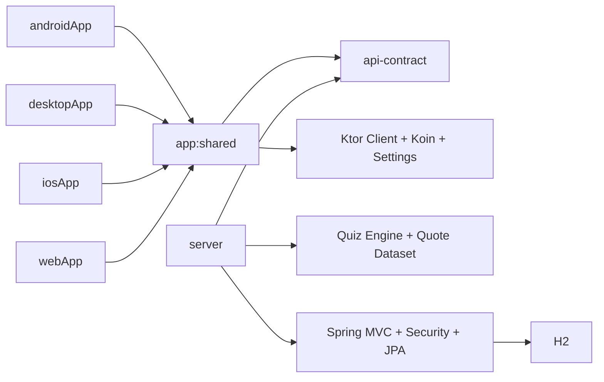

# Wisdom Trivia

[](https://github.com/evic2132/quote-quiz/actions/workflows/ci.yml)
[](https://evic2132.github.io/quote-quiz/)

> **Live Web App:** https://evic2132.github.io/quote-quiz/

Wisdom Trivia is a Kotlin full-stack quote quiz application built with a Kotlin Multiplatform client
and a Spring Boot backend. The shared client module powers Android first, with desktop, iOS, and
browser targets using the same core UI and application logic.

## Features

- Splash screen and persisted login
- Email/password authentication
- Quiz, Settings, and Profile tabs
- Binary (Yes/No) and multiple-choice modes
- 10 questions per session
- Backend-generated questions and distractors
- Correct/incorrect feedback before advancing
- Results screen with restart
- Read-only profile and logout
- Portrait and landscape support

## Tech Stack

**Client:** Kotlin Multiplatform, Compose Multiplatform, Navigation 3,
Ktor Client, Koin, Multiplatform Settings, Kotlinx Serialization.

**Backend:** Kotlin, Spring Boot, Spring MVC, Spring Security, Spring
Data JPA, H2, JWT.

**Tooling:** Gradle, Detekt, Kover, Codecov, GitHub Actions, Docker,
Render, GitHub Pages.

## Project Structure

```text
.
├── api-contract      # Shared REST contracts
├── app
│   ├── shared        # Shared KMP UI, state, networking, DI and navigation
│   ├── androidApp     # Android launcher
│   ├── desktopApp     # Desktop launcher
│   ├── iosApp         # iOS host
│   └── webApp         # Web JS/Wasm host
├── server            # Spring Boot backend
├── config/detekt     # Static analysis config
└── docs/design       # UI references and design notes
```

## Architecture



`api-contract` is shared by the client and server. Platform apps stay
thin and reuse `app:shared`.

## Supported Platforms

| Platform    | Status    | Notes                                |
|-------------|-----------|--------------------------------------|
| Android     | Primary   | Main packaged app target             |
| Desktop JVM | Supported | Shared UI via `desktopApp`           |
| iOS         | Supported | Xcode host app using `QuoteQuizCore` |
| Web JS      | Supported | Browser host in `webApp`             |
| Web Wasm    | Supported | Browser host in `webApp`             |

## Run Locally

Requirements: JDK 21, Android Studio/IntelliJ IDEA, and Xcode 15+ for
iOS. Docker is optional.

``` bash
git clone https://github.com/evic2132/quote-quiz.git
cd quote-quiz
cp .env.example .env
./gradlew :server:bootRun
```

The `.env` file is optional for local development.
The backend runs at `http://localhost:8080`.

Health check:

```bash
curl http://localhost:8080/api/test
```

### Demo Accounts

``` text
demo@example.com      / password123
reviewer@example.com  / reviewer123
```

Deployment passwords can be overridden with environment variables.

### Android

Open the project in Android Studio and run `androidApp`.

``` bash
./gradlew :app:androidApp:assembleDebug
```

The Android emulator uses `http://10.0.2.2:8080` for the local backend.

### Bonus Targets

``` bash
# Desktop
./gradlew :app:desktopApp:run

# Web JS
./gradlew :app:webApp:jsBrowserDevelopmentRun

# Web Wasm
./gradlew :app:webApp:wasmJsBrowserDevelopmentRun
```

For iOS, open [app/iosApp/iosApp.xcodeproj](./app/iosApp/iosApp.xcodeproj)j in Xcode.

### Base URL behavior

- Android uses the emulator host mapping `http://10.0.2.2:8080`.
- Desktop and iOS default to `http://localhost:8080`.
- Browser builds default to `http://localhost:8080` when opened on localhost.
- Browser builds can also override the API base URL through the `quotequiz-api-base-url` meta tag
  in [app/webApp/src/webMain/resources/index.html](./app/webApp/src/webMain/resources/index.html).

If you run Android on a physical device instead of an emulator, point the client to your machine's
LAN IP and ensure the backend is reachable on that network.

## API Summary

Base URL: `http://localhost:8080`

### Public

- `GET /api/test`
    - health/status response
- `POST /api/v1/auth/login`
    - accepts email and password
    - returns JWT token and current user

### Authenticated

- `GET /api/v1/me`
    - returns current user profile
- `POST /api/v1/quiz/sessions`
    - starts a new quiz session in the selected mode
- `POST /api/v1/quiz/sessions/{sessionId}/answers`
    - validates an answer
    - returns feedback, next question, or final result

### Authentication header

```http
Authorization: Bearer <token>
```

### Error format

API errors use a consistent JSON response shape:

```json
{
  "code": "UNAUTHORIZED",
  "message": "Authentication is required"
}
```

## Tests & Quality

``` bash
# Static analysis
./gradlew detekt --no-daemon

# Tests + aggregate JVM coverage
./gradlew :koverXmlReport :koverHtmlReport :koverVerify --no-daemon
```

Coverage focuses on `app:shared` and `server`, where the testable
application logic lives. CI uploads Detekt SARIF to GitHub Code Scanning
and Kover coverage to Codecov.

## CI/CD

GitHub Actions runs checks before affected builds and deployments.

- Android is built when Android/shared dependencies change.
- Web is deployed to GitHub Pages only for web-related changes.
- Server changes trigger Render only after verification succeeds.
- Pull requests run verification without deployment.
- Path-based change detection avoids unnecessary builds.

## Docker

``` bash
docker build -t wisdom-trivia-server .

docker run --rm -p 8080:10000   -e PORT=10000   -e QUOTEQUIZ_JWT_SECRET=dev-only-jwt-secret-change-me-32chars   wisdom-trivia-server
```

Render configuration is in [`render.yaml`](./render.yaml).

## Design Decisions

- Shared Compose UI across client targets
- Thin platform launcher modules
- Shared REST DTOs in `api-contract`
- Server-authoritative quiz sessions and scoring
- Idempotent answer submission for safe retries
- Multiplatform Settings for session persistence
- JWT authentication without refresh-token complexity
- H2 for simple reviewer setup

The project deliberately avoids unnecessary assignment complexity such
as OAuth, refresh tokens, Redis, PostgreSQL, microservices, and a local
Room database.

## Design Notes

- REST contracts live in `api-contract` to avoid coupling UI or persistence models across layers.
- Quiz answers remain server-authoritative.
- Multiple-choice distractors are generated by the backend.
- Duplicate answer submissions are handled idempotently so the client can safely retry.
- The project favors shared UI and shared state management over per-platform feature duplication.

## Design References

UI design references used during implementation are available in [docs/design](./docs/design).
