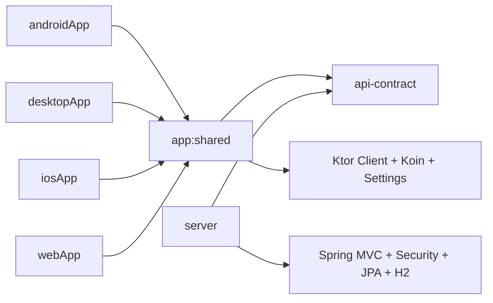

# Wisdom Trivia

Wisdom Trivia is a Kotlin full-stack quote quiz application built with a Kotlin Multiplatform client and a Spring Boot backend. The shared client module powers Android first, with desktop, iOS, and browser targets using the same core UI and application logic.

## Features

- Email and password login with persisted authenticated session
- Two quiz modes: binary and multiple choice
- Ten-question server-generated quiz sessions
- Immediate answer feedback with modal confirmation before advancing
- Quiz results summary with restart flow
- Read-only profile screen with logout
- Shared Compose Multiplatform UI across platforms

## Technology Stack

### Client

- Kotlin Multiplatform
- Compose Multiplatform
- Navigation 3
- Ktor Client
- Koin
- Multiplatform Settings
- Kotlinx Serialization

### Server

- Kotlin
- Spring Boot
- Spring MVC
- Spring Security
- Spring Data JPA
- H2
- JWT

### Tooling

- Gradle
- Detekt
- GitHub Actions
- Docker
- Render Blueprint

## Module Layout

```text
.
├── api-contract      # Shared REST DTOs and enums
├── app
│   ├── androidApp    # Android application entry point
│   ├── desktopApp    # Desktop JVM entry point
│   ├── iosApp        # iOS host app consuming the shared framework
│   ├── shared        # Shared KMP UI, state, networking, DI, navigation
│   └── webApp        # Browser host for JS and Wasm builds
├── server            # Spring Boot backend
├── config/detekt     # Static analysis config and baseline
└── docs/design       # UI references and design notes
```

## Architecture



### Client structure

- `app:shared` contains shared Compose UI, navigation, view models, repositories, API clients, and session handling.
- Platform modules stay thin and only host the shared `App()` entry point.
- Authentication state sits above tab navigation:
  - Splash
  - Login
  - Main app container

### Server structure

- Controllers handle HTTP endpoints.
- Services own quiz and authentication behavior.
- Repositories and JPA entities stay server-only.
- `api-contract` is the only shared code between client and server.

## Supported Platforms

| Platform | Status | Notes |
| --- | --- | --- |
| Android | Primary | Main packaged app target |
| Desktop JVM | Supported | Shared UI via `desktopApp` |
| iOS | Supported | Xcode host app using `QuoteQuizCore` |
| Web JS | Supported | Browser host in `webApp` |
| Web Wasm | Supported | Browser host in `webApp` |

## Local Development

### Prerequisites

- JDK 21
- Android Studio or IntelliJ IDEA with Kotlin Multiplatform support
- Xcode 15+ for iOS
- Docker for containerized server runs

### Demo credentials

The server seeds two users on startup:

- `demo@example.com` / `password123`
- `reviewer@example.com` / `reviewer123`

### Environment variables

Server configuration is driven by environment variables. Start from [.env.example](/Users/elelan/Developer/quiz-app/.env.example).

Common variables:

- `QUOTEQUIZ_DB_USERNAME`
- `QUOTEQUIZ_DB_PASSWORD`
- `QUOTEQUIZ_DEMO_USER_PASSWORD`
- `QUOTEQUIZ_REVIEWER_USER_PASSWORD`
- `QUOTEQUIZ_JWT_SECRET`
- `SERVER_PORT`

## Running the Server

### Gradle

```bash
./gradlew :server:bootRun
```

The server starts on `http://localhost:8080` by default.

Health check:

```bash
curl http://localhost:8080/api/test
```

### Docker

Build the image:

```bash
docker build -t wisdom-trivia-server .
```

Run the container:

```bash
docker run --rm -p 8080:10000 \
  -e PORT=10000 \
  -e QUOTEQUIZ_JWT_SECRET=dev-only-jwt-secret-change-me-32chars \
  wisdom-trivia-server
```

The repository also includes a Render blueprint at [render.yaml](/Users/elelan/Developer/quiz-app/render.yaml).

## Running the Client

### Android

From Android Studio:

- open the project
- select the `androidApp` run configuration
- run on an Android device or emulator

Useful verification command:

```bash
./gradlew :app:androidApp:assembleDebug
```

### Desktop

```bash
./gradlew :app:desktopApp:run
```

### iOS

Open the Xcode project:

- [app/iosApp/iosApp.xcodeproj](/Users/elelan/Developer/quiz-app/app/iosApp/iosApp.xcodeproj)

The shared framework is produced from `app:shared` with framework name `QuoteQuizCore`.

### Web JS

```bash
./gradlew :app:webApp:jsBrowserDevelopmentRun --no-daemon
```

This serves the browser app on `http://localhost:8081`.

### Web Wasm

```bash
./gradlew :app:webApp:wasmJsBrowserDevelopmentRun --no-daemon
```

### Base URL behavior

- Android uses the Android-specific base URL in `androidMain`.
- Desktop and iOS default to `http://localhost:8080`.
- Browser builds default to `http://localhost:8080` when opened on localhost.
- Browser builds can also override the API base URL through the `quotequiz-api-base-url` meta tag in [app/webApp/src/webMain/resources/index.html](/Users/elelan/Developer/quiz-app/app/webApp/src/webMain/resources/index.html).

## API Summary

Base URL: `http://localhost:8080`

### Public

- `GET /api/test`
  - health/status response
- `POST /api/v1/auth/login`
  - accepts email and password
  - returns JWT token and current user

### Authenticated

- `GET /api/v1/me`
  - returns current user profile
- `POST /api/v1/quiz/sessions`
  - starts a new quiz session in the selected mode
- `POST /api/v1/quiz/sessions/{sessionId}/answers`
  - validates an answer
  - returns feedback, next question, or final result

### Authentication header

```http
Authorization: Bearer <token>
```

### Error format

API errors use a consistent JSON response shape:

```json
{
  "code": "UNAUTHORIZED",
  "message": "Authentication is required"
}
```

## Quality Checks

### Static analysis

```bash
./gradlew detekt --no-daemon
```

Detekt configuration lives in:

- [config/detekt/detekt.yml](/Users/elelan/Developer/quiz-app/config/detekt/detekt.yml)
- [config/detekt/baseline.xml](/Users/elelan/Developer/quiz-app/config/detekt/baseline.xml)

### Tests and verification

Shared and server tests:

```bash
./gradlew :server:test :app:shared:jvmTest --no-daemon
```

Common build verification:

```bash
./gradlew :app:shared:compileCommonMainKotlinMetadata :app:androidApp:assembleDebug --no-daemon
```

Browser-target verification:

```bash
./gradlew :app:shared:compileKotlinJs :app:shared:compileKotlinWasmJs :app:webApp:compileKotlinJs :app:webApp:compileKotlinWasmJs --no-daemon
```

## CI

GitHub Actions workflows:

- [ci.yml](/Users/elelan/Developer/quiz-app/.github/workflows/ci.yml)
  - runs Detekt
  - uploads Detekt SARIF
  - verifies server tests, shared JVM tests, shared metadata compilation, and Android debug assembly
  - builds the Docker image
- [deploy-server.yml](/Users/elelan/Developer/quiz-app/.github/workflows/deploy-server.yml)
  - reruns verification
  - builds the Docker image
  - triggers deployment through a Render deploy hook

## Design Notes

- The Android app is kept separate from the shared KMP module to preserve the modern AGP/KMP split.
- REST contracts live in `api-contract` to avoid coupling UI or persistence models across layers.
- Quiz answers remain server-authoritative.
- Multiple-choice distractors are generated by the backend.
- Duplicate answer submissions are handled idempotently so the client can safely retry.
- The project favors shared UI and shared state management over per-platform feature duplication.

## Deliberate Scope Limits

This project intentionally stays small and focused:

- no refresh-token flow
- no OAuth or external identity provider
- no PostgreSQL or Redis
- no Room-based local database
- no microservices split
- no heavy Clean Architecture ceremony
- no server-side reactive stack

## Design References

UI design references used during implementation are available in [docs/design](/Users/elelan/Developer/quiz-app/docs/design).
